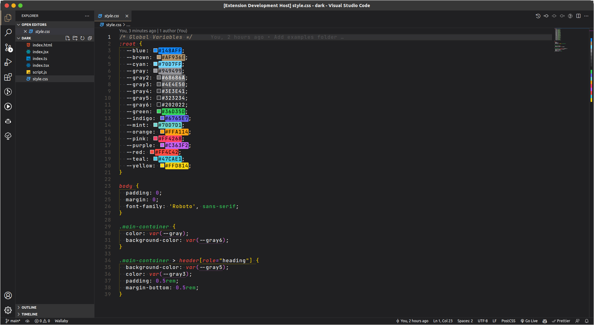
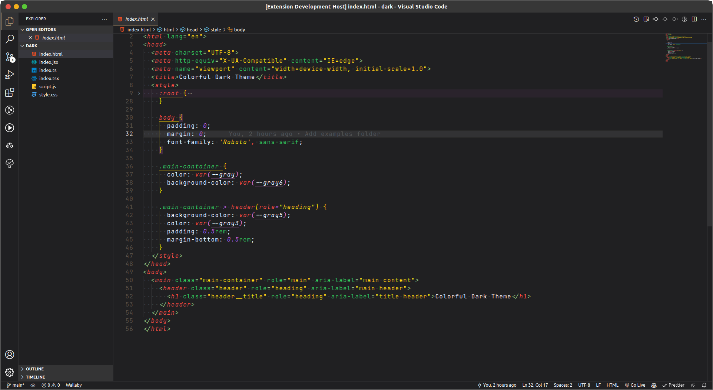
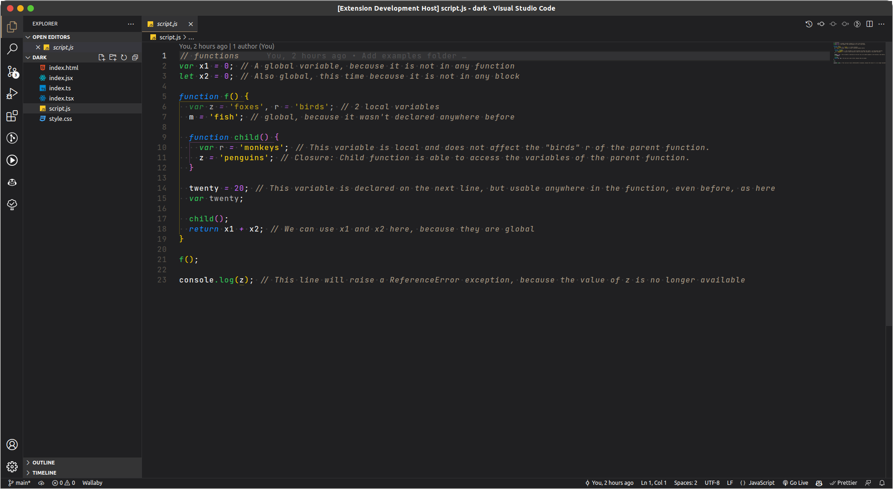
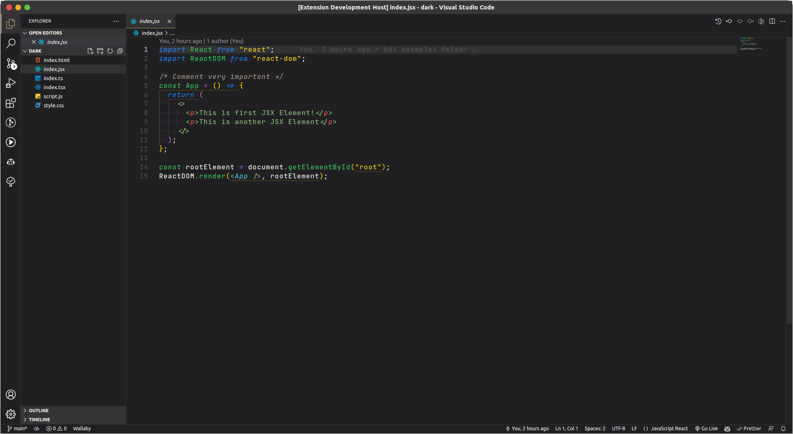
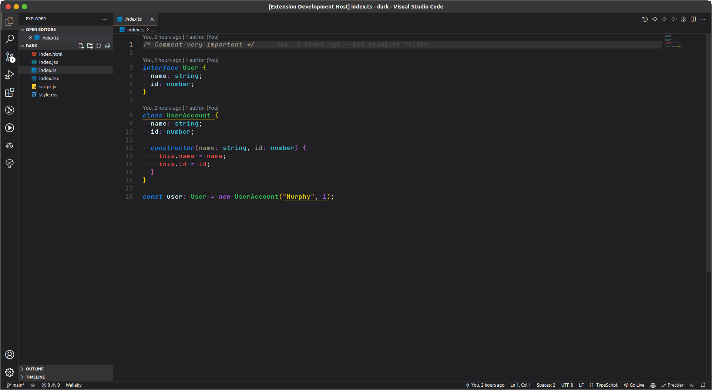
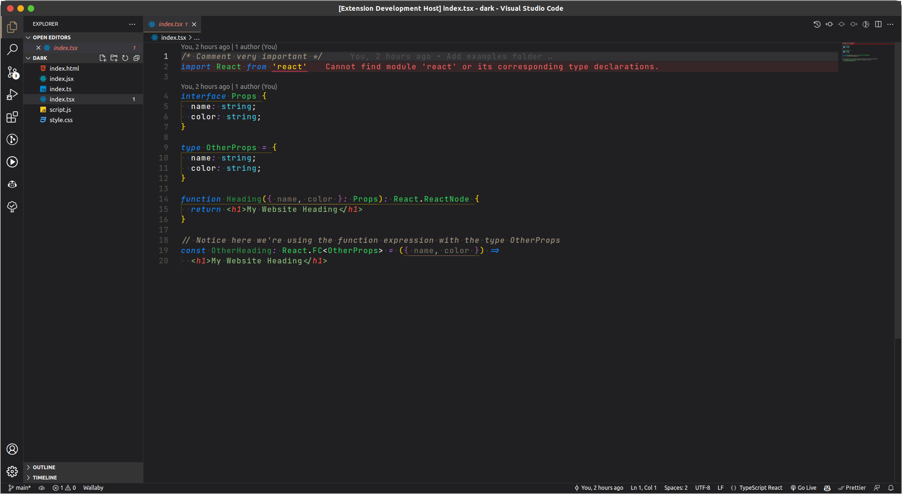

# Colorful Theme

## 📝 **Description**

Theme without nothing special, just another theme 🤓

### 🎨 **Palette Colors**

 **NAME** | **COLOR**                                                 | **HEX** | **HSL**
----------|-----------------------------------------------------------|---------|---------------------
 blue     |  | #148AFF | hsl(210, 100%, 54%)
 brown    |  | #AF936E | hsl(34, 29%, 56%)
 cyan     |  | #70D7FF | hsl(197, 100%, 72%)
 gray     |  | #949499 | hsl(240, 2%, 59%)
 gray2    |  | #68686A | hsl(240, 1%, 41%)
 gray3    |  | #4E4E50 | hsl(240, 1%, 31%)
 gray4    |  | #3E3E41 | hsl(240, 2%, 25%)
 gray5    |  | #323234 | hsl(240, 2%, 20%)
 gray6    |  | #202022 | hsl(240, 3%, 13%)
 green    |  | #36D35D | hsl(135, 64%, 52%)
 indigo   |  | #6765E7 | hsl(241, 73%, 65%)
 mint     |  | #70D7D1 | hsl(177, 56%, 64%)
 orange   |  | #FFA114 | hsl(36, 100%, 54%)
 pink     |  | #FF4268 | hsl(348, 100%, 63%)
 purple   |  | #C363F2 | hsl(280, 85%, 67%)
 red      |  | #FF4C42 | hsl(3, 100%, 63%)
 teal     |  | #47CAE1 | hsl(189, 72%, 58%)
 yellow   |  | #FFD814 | hsl(50, 100%, 54%)

### 🤳🏻 **Screenshots**

*CSS File*

*HTML File*

*JS File*

*JSX File*

*TS File*

*TSX File*
